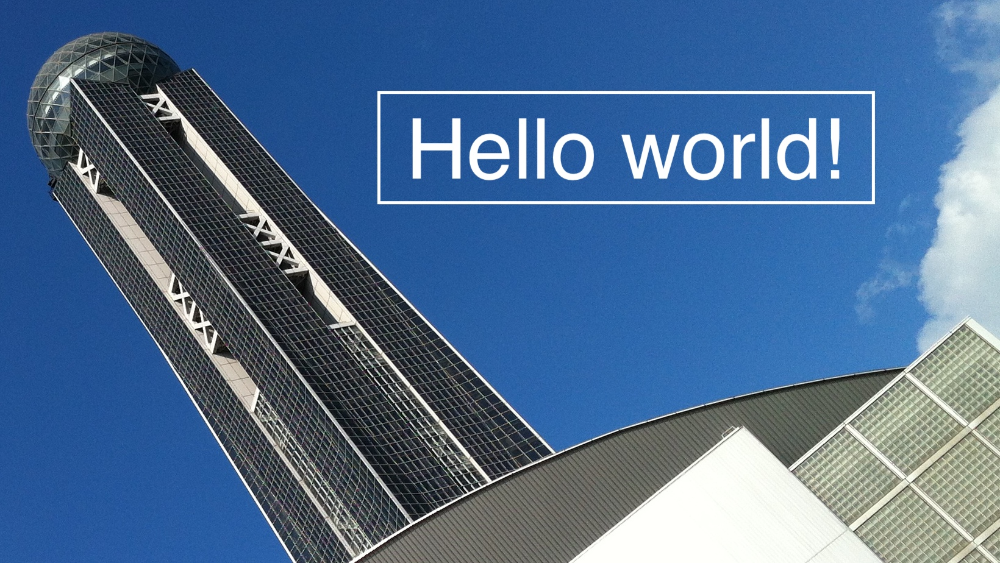

# My Profile bicity

Embedded Software Engineer with C/Shell. 
Sometimes, HTML/CSS/PHP/Python/etc...

---

---

<h1 align="center">Hi 👋, I'm Bicity</h1>
<h3 align="center">A passionate frontend developer from India</h3>

<h3 align="left">Connect with me:</h3>

<h3 align="left">Languages and Tools:</h3>

   

---

<!--
**bicity2/bicity2** is a ✨ _special_ ✨ repository because its `README.md` (this file) appears on your GitHub profile.

Here are some ideas to get you started:

- 🔭 I’m currently working on ...
- 🌱 I’m currently learning ...
- 👯 I’m looking to collaborate on ...
- 🤔 I’m looking for help with ...
- 💬 Ask me about ...
- 📫 How to reach me: ...
- 😄 Pronouns: ...
- ⚡ Fun fact: ...
-->
