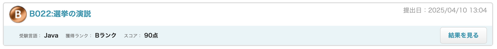
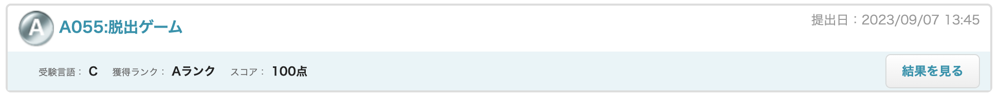
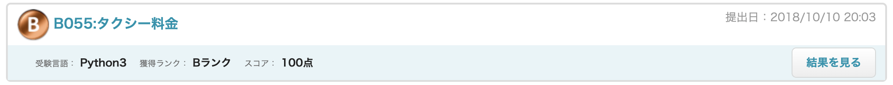
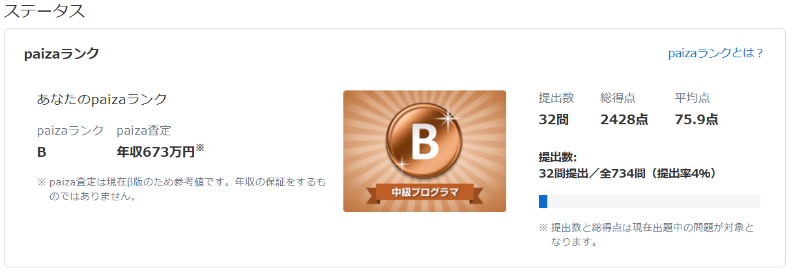

<!--

-->

---
# Portfolio  

### CUIオセロ（C言語） 

CUIで遊べるオセロです。 
2プレイヤーで交互にコマを置いていき、 
全ての盤が埋まった時点で両者のコマを計測、 
勝敗を出力します。 
https://github.com/bicity2/othello-c 

<!-- 以下、区切り線用 -->
## 

### ICTエンジニアWiki（notion) 
ポリテクセンター関西のICTエンジニアコース向けのwikiページを作成しました！ 
授業内容からITエンジニアが知っておくべきtipsまでまとめてみました💡 
https://automatic-geese-c29.notion.site/1b6f893dbc2880fd9c17cf19fbd65fb1?v=1b6f893dbc2881a1a156000caa81e495 

<!-- 以下、区切り線用 -->
## 

### 対外向けホームページ（Wix)
慶應義塾大学公認団体「慶友会」の対外向けHPになります✏️ 
プロジェクトは3人で、計画立案、実装、取りまとめを行いました🔥 
https://kobe-keiyukai.wixstudio.com/home

<!-- 以下、区切り線用 -->
## 

### Webアプリケーション（Java, Spring）
着手予定日：2025年5月1日 
公開予定日：2025年6月10日 
#### 概要
Springを用いたJavaのWebアプリケーションを作成予定。
#### 詳細スケジュール
5月1日：詳細の企画立案 
5月10日：設計書・テスト仕様書Fix 
5月25日：実装Fix 
5月31日：テストFix 
6月10日：デプロイ 

---
# Paiza Rank
## Paizaスキルチェック
- Java Bランク（2025年4月時点）

- C言語 Aランク（2023年9月）

- Python Bランク（2018年10月）

## Paizaランク情報

---
# Skills

## Embedded Software Engineer (Previously) 
C / Python / bash / Vim / Jenkins / Windows / Linux / RedHat / Ubuntu / Debian / Git  

## ICT class
### Learned
Java / Eclipse / Android Studio / Notion / Windows / Linux / Git / GitHub  

### Learning schedule
AWS / HTML / CSS / PHP / Laravel / JavaScript / MySQL / Docker  

## App developer
Flutter / Dart / VSCode / Android Studio / Figma / Windows / Mac / Git / GitHub / Gmail  

## Master's degree (Biomedical Engineering & AI)
Python / TensorFlow / Atom  

## Hobby
### Learned
HTML / CSS / MarkDown / Raspberry Pi / Arduino / Discord / Docker / WordPress  

### Learning schedule
React / Vue.js / Node.js / Spring(Spring Framework, Spring Boot) / Elasticsearch / Selenium

## Certifications
経済産業省認定（IPA）： 
　応用情報技術者（AP）、基本情報技術者（FE）、情報セキュリティマネジメント（SG） 
 
IT系ベンダー資格： 
　ディジタル技術検定 3級 
 
英語系資格： 
　工業英語能力検定 3級、実用英語技能検定 準2級 
 
その他資格： 
　普通自動車第一種運転免許 

---

# SNS (Click the icon to visit)
Instagram  

---

---

<!--
**bicity2/bicity2** is a ✨ _special_ ✨ repository because its `README.md` (this file) appears on your GitHub profile.

Here are some ideas to get you started:

- 🔭 I’m currently working on ...
- 🌱 I’m currently learning ...
- 👯 I’m looking to collaborate on ...
- 🤔 I’m looking for help with ...
- 💬 Ask me about ...
- 📫 How to reach me: ...
- 😄 Pronouns: ...
- ⚡ Fun fact: ...
-->
